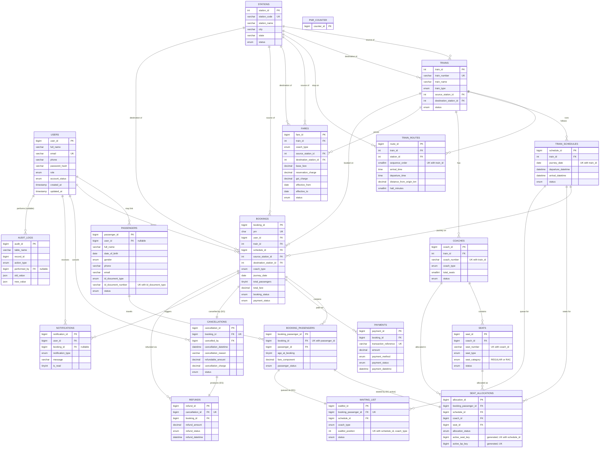

# RailFlow — Entity-Relationship Diagram

Mermaid ER diagram of all 19 tables. `||--o{` reads "one ... to zero-or-many",
`||--||` reads "one to exactly one". PK = primary key, FK = foreign key,
UK = unique key.

## Notes on non-obvious relationships

- **`TRAINS` → `STATIONS` (twice)**: `source_station_id` and
  `destination_station_id` are two separate foreign keys to the same table —
  a train's overall origin/terminus, independent of its detailed
  `TRAIN_ROUTES` stop list.
- **`SEAT_ALLOCATIONS` → `BOOKING_PASSENGERS` is one-to-*history*, not
  one-to-one.** A passenger can accumulate several allocation rows over time
  (e.g. RAC seat → released → reallocated to a regular seat on promotion),
  but only one may be `ACTIVE` at once — enforced by the generated
  `active_bp_key` column plus a `UNIQUE` index, not by a plain
  `UNIQUE(booking_passenger_id)`.
- **`SEAT_ALLOCATIONS` → seat double-booking guarantee**: the generated
  `active_seat_key` column (`seat_id` when `ACTIVE`, else `NULL`) combined
  with `UNIQUE(schedule_id, active_seat_key)` is what makes double-booking a
  *seat_id* on a given *schedule_id* structurally impossible at the storage
  engine level.
- **`CANCELLATIONS` → `REFUNDS` is 0-or-1**: a cancellation only produces a
  refund row if money had actually been paid; an unpaid, cancelled booking
  has a `CANCELLATIONS` row but no `REFUNDS` row.
- **`WAITING_LIST` → `BOOKING_PASSENGERS` is 0-or-1**: only passengers who
  couldn't be seated at booking time get a waiting-list row at all.
